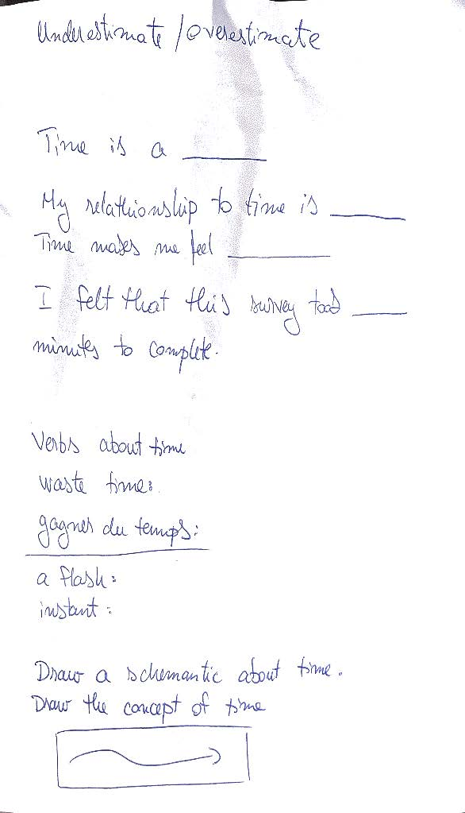

## Questionnaire 2022-10-24, Monday
A questionnaire would be a good way to gauge insights about this. It's not obvious how to ask the question, without introducing bias about time. For instance according to the drawing below the current vernacular would be used.

I'm going to need to get basic information about people.

