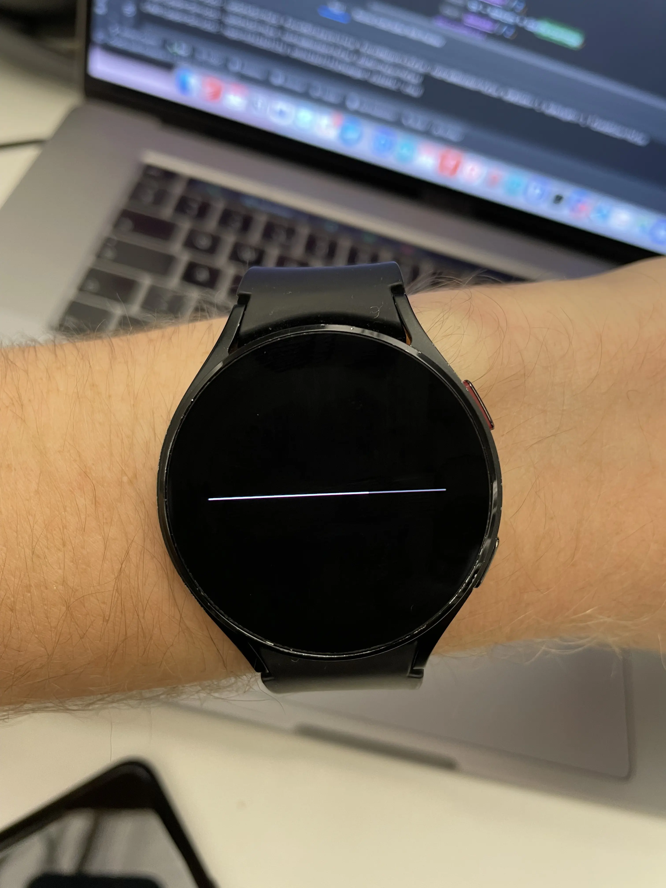

# Numberless watchfaces

I found it intriguing to create alternate watches that did not rely on the customary 24-hour, 60-minute structure.

To run different experiments, I wanted a software-based solution. WearOS had the most reach and hackability among the main options, so I bought a second hand Galaxy Watch 4 and tried that.

The most minimal design I could come up with was a straight line. Afterwards, I added a grey line beneath showing the entire length to be able to see where the line ends. 

