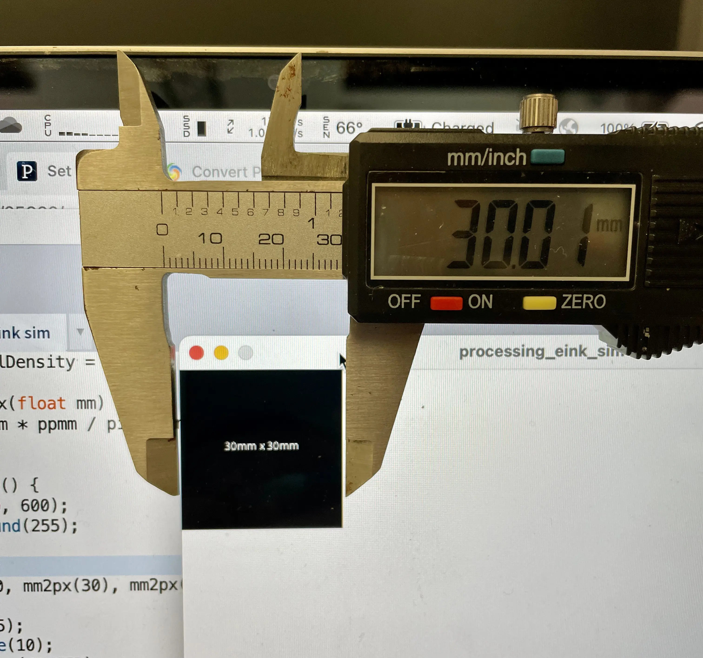

# Hardware considerations


I'm looking at [these](https://www.bastelgarage.ch/bauteile/displays/e-ink-epapers-display?limit=100) e-ink screens and other hardware available in Switzerland. I created an [Airtable spreadsheet](https://airtable.com/shr6Nev4DOkmD801Z) to use it and a [CSV export](./object/2022-eink-shopping.csv).

They function with the [Adafruit GFX library](https://learn.adafruit.com/adafruit-gfx-graphics-library), which uses [GNU Freefonts](https://www.gnu.org/software/freefont/) encoded into a bitmap format. This has memory implications, as noted [here](https://learn.adafruit.com/adafruit-gfx-graphics-library/using-fonts).

## Size simulation
[Processing sketch](/code/processing_eink_sim/processing_eink_sim.pde) 
``` java
float ppi = 226;
float inch2mm = 25.4;
float ppmm = ppi / inch2mm;
float pixelDensity = 2;

float mm2px(float mm) {
  return mm * ppmm / pixelDensity;
}
```



[Available bitmap fonts](https://learn.adafruit.com/adafruit-gfx-graphics-library/using-fonts) are in `9, 12, 18, 24` pt sizes.

Decision: freesans or freemono