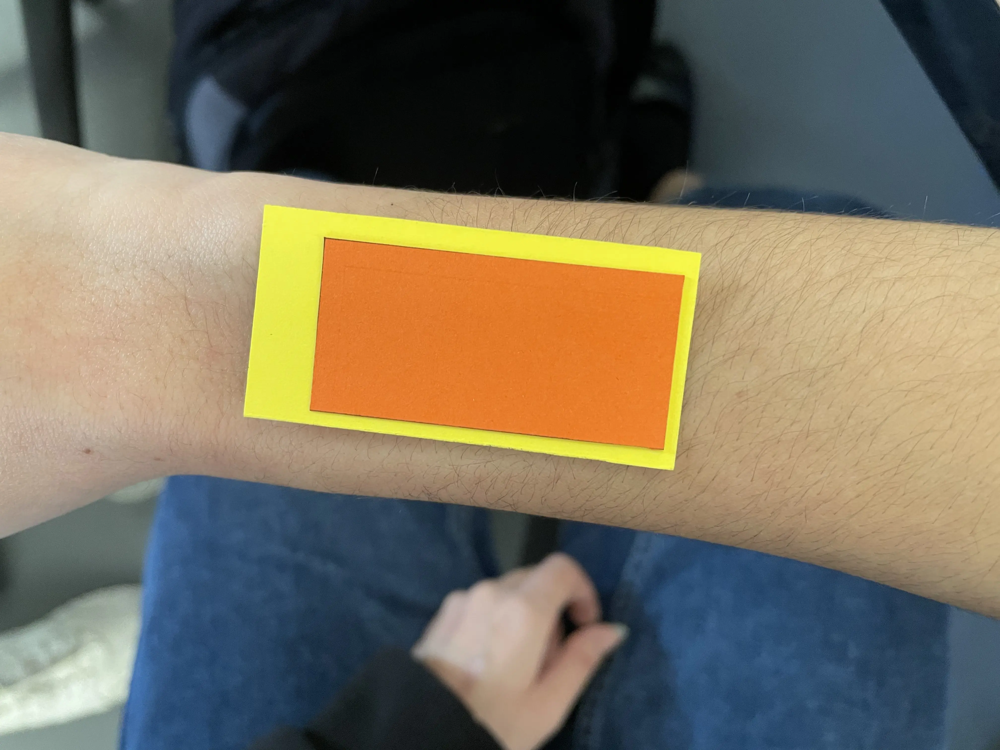

# Hardware simulation

I narrowed down the search to the following screens: 

* LilyGo T5 ESP32 Modul mit 2.66 Inch E-Ink Display

* 200x200 1.54inch E-Ink Raw Schwarz / Weiss e-Paper Display

* 250x122 2.13inch E-Ink Raw Schwarz / Weiss e-Paper Display

* ESP8266 Universal Raw e-Paper Driver Board WiFi

* 2.13 Zoll E-Ink Cloud Modul mit WiFi und Bluetooth

## Hardware screen sizes

## Strap tests

## Size vs iPhone

## Screen size on different people
It is quite large on a woman's wrist.

Faustine

Douglas

I tested [Gone Home](https://store.steampowered.com/app/232430/Gone_Home/).

