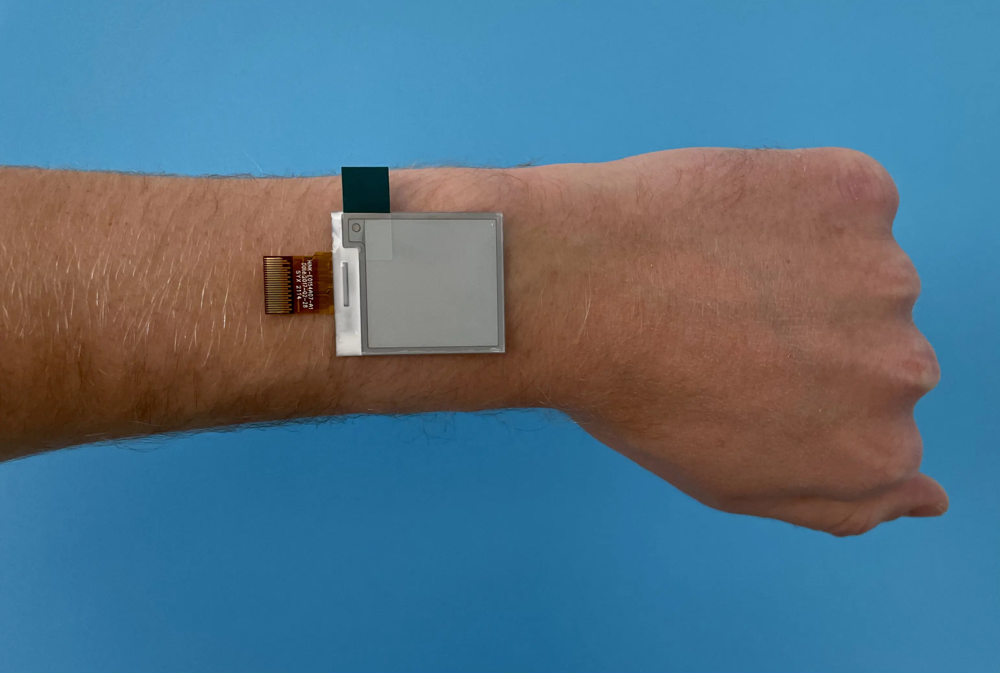
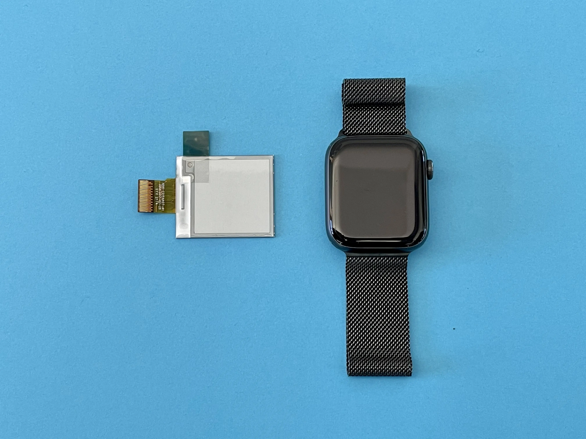
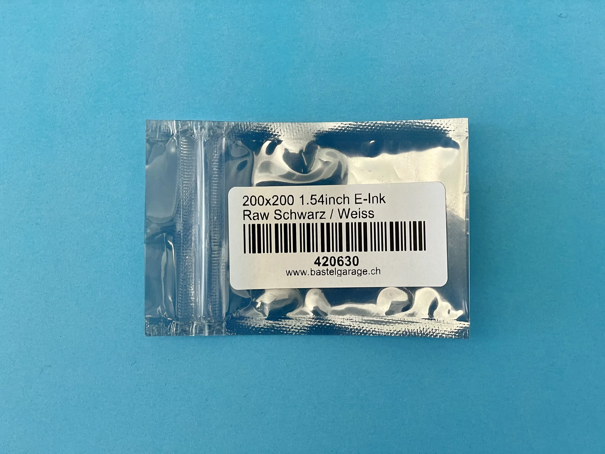

# Hardware testing

## Device size
The 1.54 inch square screen seems more realistic as a wearable size. 

I chose a strip by [eupholie](https://www.instagram.com/p/CdD4G3ZKyVs/) to test the resolution, because it is black and white and the text is very thin. 

## Animation

The animation has a big 
[refresh time as it can be seen here.](./img/2022-12-08_eupholie-eink-horizontal.mp4) [(Direct download)](https://github.com/TiborUdvari/head-md-time-in-time-out/raw/main/process/img/2022-12-08_eupholie-eink-horizontal.mp4)

## Level vs dithering
Dithering allows to have a bit more resolution. Notice how the eye dissapears with a naive level.

Dithering

Mono level

Original image (200px x 200px)

