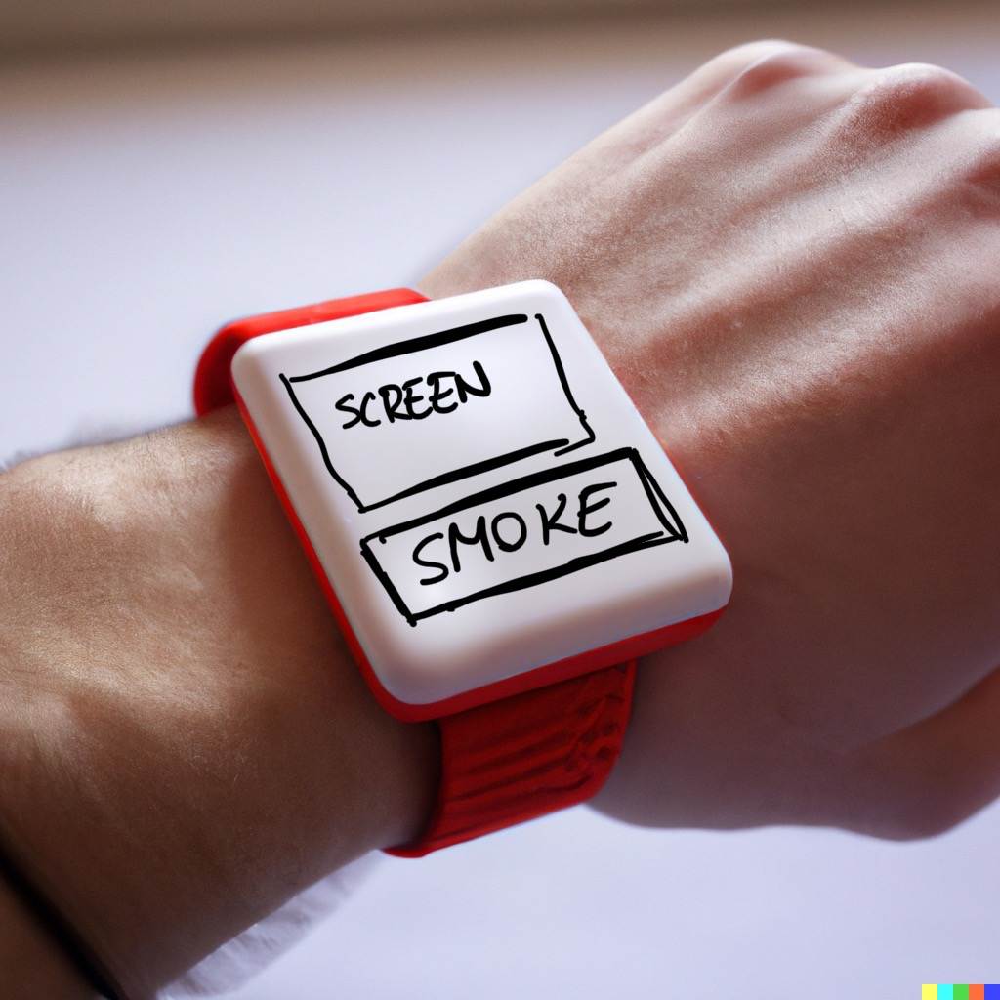

# Test day

## Insights
* People think that the object is ambiguous. They are interested because they don't know the object's purpose. Is it for smokers or not? It starts a conversation, which is the point. 
* Non-smokers sometimes didn't understand that the word SMOKE was related to cigarettes or tobacco. They thought it was more about general smoke, like in the theatre.

## Test day transcript

## First Session - Amaury, Narges, Salomé

[00:00:00] **Tibor:** Imagine an object that is kind of like this with the screen. It's going to be a more finished object that looks like this with this screen and a big button that says smoke, smoke on. 

[00:00:12] **Salomé:** It says smoke? 

[00:00:13] **Tibor:** It says the word smoke. It's not the word screen. It's actually a screen. So what would you expect something like this to do? 

[00:00:22] **Amaury:** If it's a screen and a button, you want to press the button? 

[00:00:25] **Tibor:** And what would you expect to happen if you press the button? 

[00:00:28] **Amaury:** Something change on the screen? 

[00:00:33] **Salomé:** Yeah, I'm a bit confused with the word smoke. I would say it has a link with like what's happening on the screen, but just with the word smoke.

[00:00:44] **Salomé:** I don't understand. 

[00:00:46] **Narges:** For me, similar to theaters. Like when a scene wants to go to other scene, the smoke comes and the other, the actors coming on the scene. Maybe I'm pushing it and scene by scene I'm changing it with the smoke [00:01:00] coming in the screen. 

[00:01:01] **Amaury:** Mm-hmm. . 

[00:01:02] **Tibor:** Okay. How about if you would see a text on the screen that says something like smoke break.

[00:01:08] **Tibor:** How would that change something? 

[00:01:10] **Amaury:** Yes. I think it, it relates more to the gesture of smoking cigarettes. 

[00:01:17] **Narges:** Can I think more?

[00:01:18] **Tibor:** You can say the same thing.

[00:01:20] **Narges:** No, I just need to think more. 

[00:01:23] **Salomé:** Yeah. Yeah, for me, just about the habits of going on a break when you go to smoke, but as a non-smoker, I don't really relate, so, but I see the, like, the &quot;gestuel&quot; of going.

[00:01:39] **Tibor:** So just, 

[00:01:41] **Narges:** I think maybe it is for the, that dead times that you have when you go for smoking and the break and you can use it then, then you come back. 

[00:01:50] **Tibor:** Can I say when I didn't introduce the, the theme of smoking cigarettes, when you said just saw smoke, you didn't think about smoking cigarettes, neither did you.

[00:01:57] **Salomé:** No. 

[00:01:58] **Amaury:** I'm a bit biased [00:02:00] because I, 

[00:02:00] **Tibor:** Because you know about the project. 

[00:02:01] **Amaury:** I know about it, but if I make an abstraction and I just see written smoke and then there's a screen I can't expect, it'll be this straight away. 

[00:02:11] **Tibor:** Yeah. Okay, cool. 

[00:02:12] **Amaury:** Can be follow something else, but 

[00:02:14] **Salomé:** For me smoke was maybe, oh, it's supposed to, like to blow into the object or something like this, so that's why I'm a bit confused.

[00:02:22] **Salomé:** Because just smoke is not really clear for me. 

[00:02:24] **Narges:** I'm thinking if you want to refer us to the notion of a smoke, it might be better to make the interaction similar to the way that you smoke. Not just pushing a button. 

[00:02:35] **Tibor:** Okay. I'll have a question about this.

[00:02:37] **Tibor:** I have a question about this later. 

[00:02:38] **Salomé:** Okay. Maybe the word smoke is not great, but maybe for example, the logo or thing like this is more clear. 

[00:02:44] **Amaury:** It can be visual as well. It doesn't have to be written smoke because it can be interpreted in different ways. And if it's pictographic, , maybe more clear. Mm-hmm.

[00:02:54] **Tibor:** Yeah. Okay, cool. Thank you. This is the, the first test [00:03:00] and so you are not a smoker. 

[00:03:02] **Narges:** I have smoked, but I don't usually do that. 

[00:03:05] **Tibor:** Okay. You, you just like, you just tried it once or twice. Okay. And you're not a smoker either? No. Okay. And you're a smoker. 

[00:03:13] **Amaury:** I'm back into heavy smoking, yes. 

[00:03:15] **Tibor:** Okay, great. 

[00:03:15] **Tibor:** Do you have people in your family who smoke a lot and it pisses you off? 

[00:03:21] **Narges:** No, but I have had some friends who were so, you know, the smell was so bad. The smell of their body. 

[00:03:26] **Tibor:** It wasn't somebody that you're close with. It would be like really a daily problem. 

[00:03:31] **Narges:** I don't know. 

[00:03:32] **Tibor:** Okay. How about you?

[00:03:33] **Salomé:** Also friends, not family. 

[00:03:35] **Tibor:** Okay. So not somebody you're so close to that you would like be living with somebody who's like a chain smoker? 

[00:03:40] **Salomé:** No, sorry. 

[00:03:42] **Tibor:** What context now that you say this could be a cigarette or something and only a screen, what, what do you think if you would just see a picture like this on the internet, what would you think is the context? 

[00:03:52] **Amaury:** What picture? You mean 

[00:03:53] **Tibor:** this? Yeah. Yeah. If it were like, for real. If it were a picture of the object and you would just like see this, what would you think?

[00:03:59] **Tibor:** Of the [00:04:00] context, 

[00:04:00] **Amaury:** The context of use of this device. It's 

[00:04:02] **Tibor:** not just like, what is it? Why would you see it? You know? Is it like 

[00:04:06] **Amaury:** I think it's a bit it's kind of weird 

[00:04:08] **Tibor:** now. So why, what, how would you try to make sense of it? 

[00:04:12] **Amaury:** I don't know. It feels like technological something Yeah, that makes a parallel between maybe an action that you're supposed to do physically by smoking, but then having this transcribed to a.

[00:04:25] **Amaury:** Makes it question like, is it tracking the data When you smoke you don't exactly know what it is happening. Would you 

[00:04:32] **Tibor:** think it's A real product or would you think it's a game? Would you think it's a joke? Would you think it's a performance, would you think? I 

[00:04:39] **Amaury:** don't think it as a joke. I think it's more like maybe some kind of uh, helping device 

[00:04:47] **Narges:** I think it's.

[00:04:48] **Narges:** Something related to now I, I'm biased because I know a little bit, so I'm like, it's related to smoking. And it might be like, I should push the button when I'm starting [00:05:00] smoking, and then maybe it's inhaling and exhaling the cigarette. I'm gonna interact with the screen. Mm-hmm. , so does the button maybe just, it might be just for the start and the ending point, and then I'm gonna interact with 

[00:05:12] **Salomé:** this one.

[00:05:14] **Salomé:** For me, it would be something like, Is it like telling you to, maybe telling you to, maybe you smoke too much and it'll be something rewarding when you smoke less, but I don't know how it would like work. Is it like every time you go for smoke breaks, you touch the button or something? Or do you, do you like blow into the, the watch every time you go for a smoke?

[00:05:36] **Salomé:** I don't know. But yeah, it would be maybe rewarding because I guess you don't, oh, maybe if you take the irony, if you go for a lot of smoke breaks, then it's gonna be something, I don't know, evolving more than if you don't go, but I don't know which side you, you 

[00:05:55] **Tibor:** choose. Mm-hmm. . Interesting. Okay. How about if you saw this picture and somebody says, this is [00:06:00] a smoking stimula.

[00:06:04] **Salomé:** I don't understand 

[00:06:06] **Tibor:** if like you would just see like a post on the internet, you see the same picture, but as the title of the article it says Smoking simulator. 

[00:06:14] **Salomé:** I would not understand. Okay. It's gonna be 

[00:06:17] **Narges:** like smoke is like gonna be like, And then, then you, maybe you should just leave the button and it's like, exhaling.

[00:06:26] **Narges:** But I am thinking stimulating because when I smoke cigarettes, I have a special feeling like, like this because I do it once in a six months and I always have the, it turns the have a bit. Yeah. So it might simulate the same feeling 

[00:06:45] **Tibor:** or something. Okay. I'm gonna focus more on him cuz he's more the target audience.

[00:06:49] **Tibor:** The target audience is for smokers, so if you're like regular smokers, 

[00:06:54] **Amaury:** I think the term simulator is Can be a bit weird to use in the context of [00:07:00] smoking if it's a health device, if it's something, I don't know. I don't know yet the context. But simulator can mean playful, and it's a bit cringe to associate the playfulness with smoking because it relates to a bad health habit and.

[00:07:13] **Tibor:** How does it, how does it make you feel? Does 

[00:07:15] **Amaury:** it mm-hmm. , I think morally it can be misinterpreted, so I would suggest to use a term that's not simulating something, but rather 

[00:07:28] **Tibor:** what, do you share his opinion? I'm, I'm sorry? Do you share, do you share his opinion about the morality of the thing? 

[00:07:36] **Salomé:** Do you share?

[00:07:37] **Salomé:** What do you mean by you share his opinion? I don't get sharing. What, 

[00:07:41] **Tibor:** what do you mean? Do you have his, his opinion about it could be morally weird to have like a smoking simulator. 

[00:07:49] **Narges:** I don't say it morally. I don't say it immoral. I am like, because I don't know the, the process of the what is happening in the screen.

[00:07:56] **Narges:** Maybe it's gonna inhabit me from doing that, so, 

[00:07:59] **Tibor:** mm-hmm. . [00:08:00] Okay. So you don't think it's prob problematic? You're not triggered by it, like out of the game. Yeah. Inhabit, I'm sorry. 

[00:08:05] **Salomé:** Okay. How about you? Yeah, I'm, yeah, I agree. The word simulator, I think is the big wig smoke simulator. I don't get what you mean behind it, but also like, it depends like, what's the sense of the object?

[00:08:20] **Salomé:** Is it like positive or 

[00:08:23] **Tibor:** or circle? Well, if you don't have the, if you don't have the context, what would you think is the question? 

[00:08:28] **Salomé:** I mean, smoke simulator would be something like maybe smoking, the person smoking. I don't 

[00:08:33] **Tibor:** know. Okay. Thank you. Wait, Amari, can you try, try it out this this game and tell me what you think and describe it while you're playing it.

[00:08:42] **Amaury:** Okay, so it's like as if I had this device on me or around me. 

[00:08:49] **Tibor:** Imagine that. Okay. Useless. But imagine you the screen, it says this and you did, you only have the button. 

[00:08:56] **Amaury:** Okay. Then I'm gonna press the button. [00:09:00] I smoke because it's a good way to take a break from work and clear my mind. Cigarettes one, so there's a counter, maybe it counts the cigarettes I smoke.

[00:09:08] **Amaury:** Then I could have the decision maybe to leave it as it is or I can press against smoke. I smoke because it makes me look cool and sophisticated like Douglas. Okay. It, it seems to me. Is there, there is a funny way of writing it. I don't know 

[00:09:28] **Tibor:** why or tell me how it makes you feel. Specifically if you had this device and you had this.

[00:09:34] **Salomé:** Mm. 

[00:09:37] **Amaury:** It kind of, it, it brings towards me an image of myself smoking, maybe not an image of myself, especially maybe some, someone else maybe. And. It, it can make me question, why am I smoking maybe. Mm-hmm. . 

[00:09:54] **Salomé:** Yeah. For me, it's a little bit about 

[00:09:57] **Narges:** some sentences that makes me feel [00:10:00] like I'm an empty person. 

[00:10:02] **Salomé:** Like 

[00:10:03] **Tibor:** it makes you feel, okay.

[00:10:05] **Tibor:** Can you develop 

[00:10:05] **Salomé:** that empty. Yeah, it's 

[00:10:07] **Narges:** like I smoke because it makes me look cool and sophisticated. What the hell do I need the smoking to look cool and sophisticated and it's like being a loser or something for me, like . 

[00:10:20] **Tibor:** Okay. Thank you. Okay. Feel free to add anything in here. Okay, 

[00:10:25] **Amaury:** so I'm pressing the button again, and now I'm at the cigarettes counter free.

[00:10:31] **Amaury:** And then it says, I smoke because it helps me to feel more confident and assertive. I don't agree with that cuz I don't think smoking helps me to be like this. But yeah. Okay. Maybe it's the reason of someone else and then I'm questioning this. This thing to say like that's not true, I would say, but yet I smoke again.

[00:10:54] **Amaury:** And now it says, I know a man who gave up smoking, drinking sex and rich food. [00:11:00] He was healthy right up to the day he killed himself. Okay. That's pretty intense, dark. 

[00:11:06] **Tibor:** How does this compare to the other ones? 

[00:11:09] **Amaury:** I think there's, that escalated quickly. , I would say. And yet you can still smoke, so that must be worse than that maybe.

[00:11:19] **Amaury:** Mm-hmm. , I smoke because it's a good way to take a break from work and clear my mind. 

[00:11:24] **Narges:** I think it's random, it's not progress's. 

[00:11:27] **Amaury:** It feels like random to me now because after it escalated super quickly, now it's back to something a bit more quiet and yeah, normal. Like that's probably my reason to smoke. It's to have time for myself to think and take a mental break.

[00:11:44] **Amaury:** And 

[00:11:45] **Narges:** for me, something interesting about it is that you have some, some sentences and they're directly about smoking. Mm-hmm. , but they're more than smoking. Mm-hmm. , they're more about you, and then you are gonna understand your position. It's like, [00:12:00] Without, with every sentence as you're like, am I like this or I'm 

[00:12:04] **Salomé:** not?

[00:12:04] **Amaury:** So yeah, you try to relate to what you see that's written. And of course it can be, it cannot be the case. It can be the case. But yeah, you, it dress a reaction of the person wearing the device somehow. So I keep smoking. I only smoke when I'm bored, and I am never bored. Okay, so is this. So this is someone not smoking or what

[00:12:33] **Salomé:** maybe, I dunno. Yeah, maybe you, you use the text generator for this sentences, but not sure. Yeah, I think it's like 

[00:12:45] **Narges:** when you feel bored, you smoke, but then quickly after that you don't feel bored. So after all you're like, I haven't, I wasn't worried 

[00:12:54] **Salomé:** throughout these days. Because you healed it with of smoking, right?

[00:12:57] **Tibor:** Mm-hmm. , can you tell me a little bit about [00:13:00] what you think that there's only one button on the device. 

[00:13:05] **Salomé:** Sorry, 

[00:13:06] **Amaury:** repeat. Can 

[00:13:06] **Tibor:** you tell me about what you think about the fact that there's only one button and only one thing that you can do? 

[00:13:13] **Amaury:** I'm a bit annoyed because it seems like there's no solution except smoking more and more, so I'm, I wonder.

[00:13:21] **Amaury:** When does it end? Do you just stop you expressing smoke or is there another option somewhere? 

[00:13:30] **Salomé:** Like, does it go get back to zero every day or is it like an addition of like every, every, every cigarette. There's also the counting. It's an addition. Okay. So yeah, it can go to a lot if you, yeah. Okay. Then. Yeah, I think what's interesting is it's, is when it's escalating into like I dunno, like sentences like really dark or mocking or like Really sarcastic [00:14:00] about smoking, but it should, I think it should be graduate, because right now it seems random as we said.

[00:14:08] **Tibor:** Mm-hmm. , it is, it is random. Mm-hmm. . Okay. Right. That right now it is random, but this is, I didn't have time to do it, but I would want it to be an escalation. Mm-hmm. . Mm-hmm. Yes. And have more because more variations. The button would be the same, but if you sp press smoke, faster. You'd have something that's like, oh, you just smoked a cigarettes two minutes ago.

[00:14:30] **Tibor:** Yeah. Mm-hmm. . 

[00:14:33] **Salomé:** Can we give feedback now or is it, 

[00:14:35] **Tibor:** No, not yet. Not yet. 

[00:14:36] **Amaury:** We have 10 mil, 10 minutes left. I would say 

[00:14:39] **Tibor:** I'm more interested in how it makes you feel and then we can, I can tell you what I, I try to do and then maybe we can discuss like what you guys will do like differently. I'm mostly interested in what am already as a smoker thinks about having these, these texts in front of him or the counter.

[00:14:56] **Amaury:** It makes you feel like , you don't have the control on the habit. The [00:15:00] habit controls you. So, and it can be for many reasons. So maybe sometimes you won't relate to that. You'll say, that's not me, that's someone else's maybe. But when it's you, then you're like, okay, point noted. Now what should I do about it?

[00:15:19] **Amaury:** And, but then once I get to that, I'm a bit frustrated because the only option on the devices to smoke is to keep smoking. And unless you remove the device, it's not gonna stop, make you stop smoking, you're just not gonna use the device again. 

[00:15:39] **Tibor:** Did you ever try things to stop smoking? So, did you ever try any, like did you ever be like, oh, I wanna stop smoking and try like, different hacks or techniques?

[00:15:50] **Amaury:** No, I, I only stopped smoking straight away without taking nicotine or anything. Cold Turkey. Yeah, cold Turkey, [00:16:00] and it was painful for the first three days, and then it was getting better and better. It's mostly about breaking the habits once you stop like you flushed the ni the nicotine out of your body.

[00:16:12] **Tibor:** How would you feel if somebody gave this to you as a present? 

[00:16:17] **Amaury:** I wouldn't want it to be a presence somehow. I would rather that it be a choice of mine to where it is as a way to track this habit and to, but to receive this as a gift. This kind of like

[00:16:34] **Amaury:** it's like someone else is telling you to stop. 

[00:16:38] **Tibor:** Would you buy it for. . 

[00:16:39] **Amaury:** If I'm in a stage where I'm trying to quit, but I can't make this on myself alone, maybe, yes, 

[00:16:50] **Salomé:** and I, I think the, the device could also make the person feel bad. Like, I don't think it's really positive vibes. That's also, but that's why I'm [00:17:00] a little bit skeptical be because if I was a smoker and I would have sentence.

[00:17:05] **Salomé:** Oh, like, I don't know, but like the, the one like 

[00:17:08] **Amaury:** notification you just want to push inside and 

[00:17:12] **Salomé:** if you like smoke more and more, then you have like gradually, like darker and like meaner sentences. I feel like just the, the vest would make you feel super, super. So 

[00:17:26] **Amaury:** I think No, no, no. I think we have to be careful about the tone that maybe be too

[00:17:35] **Amaury:** That's what I was trying to say. Do 

[00:17:37] **Tibor:** you think there's a tone that is moral in this compared to other campaigns or smoke anti-smoking? , 

[00:17:44] **Amaury:** it can be more based on when you have this thing that's pressing you more and more in the escalation of saying things, it can be it can be perceived as being 

[00:17:58] **Tibor:** Well, it's not telling you to, [00:18:00] to do anything.

[00:18:01] **Tibor:** There's just a button on it where it's your choice. . 

[00:18:05] **Amaury:** Mm-hmm. . But yet it makes you face with your bad habit and yeah. 

[00:18:15] **Salomé:** I think when you are a smoker, you are aware like that smoking is not a healthy habit. Right? I don't know if ammo agrees, but I think you are aware that smoking is not a healthy rabbit have happy habit, but you don't maybe like, it's not really.

[00:18:31] **Salomé:** Efficient to be reminded that it's not, not a happy No, 

[00:18:36] **Amaury:** it's about habits. 

[00:18:36] **Salomé:** Smokers, no, it's not a happy habit because I mean, lot of smokers try to stop and then come back and then stop and Yeah, I, yeah. I think it depends on the tone you take with it. Mm-hmm. . 

[00:18:50] **Tibor:** Okay. And the last question, I'm gonna let you read two.

[00:18:52] **Tibor:** We have a few minutes left. Yeah, this is a few minutes left. So this is two pitch proposition, pitch A, and pitch pitch B. I'd like [00:19:00] you to read both and tell me which one you think is what you think of both. In which situation would one work better? In which situation would the other one work better?

[00:19:39] **Tibor:** Can we switch?[00:20:00] 

[00:20:13] **Salomé:** Thank you.

[00:20:27] **Tibor:** Are you 

[00:20:27] **Amaury:** finished reading? Yeah. It feels to me like this is a non-smoker device to make fun of smokers. It's not relevant to me. 

[00:20:35] **Salomé:** For, for me, you say like, offer it to your smoker friends, but you also say that it can be like simulation of like real life obstacles for smokers. So I think it's your text is 

[00:20:48] **Tibor:** Wait, I, I would like, how about if we take this one out?

[00:20:51] **Tibor:** Cause I don't think it's, is

[00:20:52] **Salomé:** yeah. This, yeah. Guys are giving vibes non 

[00:20:57] **Tibor:** We take this out. Yeah. Yeah, you can.[00:21:00] 

[00:21:02] **Salomé:** And it's. And still, I think what you miss in for smoke break for example, is the goal of the object. If it's for smokers, what's the goal with them carrying it? Because, because you say that like helping them to see the absurd absurdity of the habit, but I feel. Just if you afraid this to your friends, it's, it's a bit mean if you, if it's, yeah, it is.

[00:21:35] **Salomé:** Yeah. But, so I think, like, I think they're like, I don't know if I already agrees, but I think smokers have from non smokers sometimes remarks about them smoking. Mm-hmm. and I, I don't think it's also to add an object to it. I don't think it's like Yeah. A good idea. Mm-hmm. , but yeah, I don't see the, the meaning of the objective.

[00:21:58] **Salomé:** I mean, it could be a nice subject [00:22:00] if you, 

[00:22:01] **Tibor:** okay. Let's discuss, let's discuss the second, the second one. What do you think about the second one? I just, 

[00:22:06] **Narges:** I just wanted to add something. Yeah. Because for me, the object is about, because I know there are some sentences so they can narrate something and then we can say like, if somebody is can I.

[00:22:17] **Narges:** Yeah, sure. If this is the day and they are having this much cigarette, the narrative would be different. But they are, if they are quitting, so they are having less, 

[00:22:27] **Salomé:** the narrative 

[00:22:27] **Tibor:** would be different. No, it's still, it's still the, the vibe. The vibe is still gonna be like, You have something that's, that smokers say usually to themselves that, that smokers always like this stuff that some, a lot of people who smoke say, no.

[00:22:42] **Tibor:** I mean, this can for me. It'll never, it will this, this object will never tell you to stop smoking. 

[00:22:48] **Narges:** No, I, I don't mean that it should tell you stop smoking, but I think it should be a little bit different when you are quitting it or you are making it worse. So maybe it should be a [00:23:00] narrative inside that the, the tone and the.

[00:23:04] **Narges:** The way that they're saying words, they should be different. But for me, it's really interesting that you are gonna read some sentences and it it just gives you insight and you can work on it. I don't know how, but it can, it can get better and I see it as something helpful. 

[00:23:24] **Tibor:** Okay. For this one. We're talking about the smoke breakage.

[00:23:28] **Tibor:** Mm, yeah. Let's just go try to wrap up. What do you think about the second, second one? The second one, Sigi time is it says that it's more of a fictitious product. In a world where people don't know about smoking, does it make more sense for it to be a fictitious product like this? 

[00:23:49] **Amaury:** I think what I would've liked to see is that it's something.

[00:23:53] **Amaury:** Helping you instead of being satirical or being a simulator game. I think the game aspect of [00:24:00] it is not feels not right to me. How would you use 

[00:24:02] **Tibor:** this if you, if you were took the decision to use this, how would you use this? It's an ING screen so you can wear it for weeks on end without having to recharge it.

[00:24:11] **Amaury:** Mm-hmm. . Yeah. But I mean I think in the formulation of the. in both cases. It's something that you, you don't know clearly If it's if it's for, if it's criticizing or if it's encourage you to smoke in a way because it's 

[00:24:30] **Narges:** game, maybe you want to smoke more to experience the game more, so it's gonna be worse for you.

[00:24:38] **Narges:** I don. 

[00:24:40] **Tibor:** So do you think, because obviously it's so what you're saying, tell me if, if, if you agree with how I'm resuming what you're saying, it can be problematic because it encourages you to smoke. Mm-hmm. , I think Yes. You think it, it's an object that encourages you to smoke? 

[00:24:56] **Salomé:** Yeah. I think it can because there's this thing of [00:25:00] like, there's kind of a progression even though I don't know if it's good or bad.

[00:25:06] **Salomé:** Like, yeah, maybe you want to like progress more into the game and so you going to smoke more cigarettes. I dunno. 

[00:25:15] **Tibor:** How do you feel as a smoker seeing the number of cigarettes as a high score? Because the progression is a number of cigarettes which you we associate as being something bad. 

[00:25:26] **Amaury:** Maybe it can be taken the reverse way.

[00:25:28] **Amaury:** Maybe the counter is at a certain amount, let's say, I don't know, 5,000 or, and Amy, at some point it should lead to zero. And you say, okay, now it's time to for you to stop. I think thousand cigarettes, I don't know, but I think it changed the tone a little bit. Like if the count goes higher, people will want to smoke more to continue what's going on on the watch.

[00:25:52] **Amaury:** Maybe the time aspect of it once you reach a certain amount of cigarettes and steps. Maybe it's supposed to tell you to [00:26:00] stop in a more gentle way, instead of being satirical about the number of cigarettes, you smoke more and then it tells the story. 

[00:26:08] **Tibor:** I don't Do you think it's making any commentary except from the object itself about, about smoking?

[00:26:14] **Amaury:** No. But based on the peaches you have. Yeah. I think that for me that's more 

[00:26:19] **Tibor:** Would this object make more sense with the pitch, with this pitch or one of the two?

[00:26:30] **Tibor:** Does 

[00:26:30] **Amaury:** it matter? I think it does not matter. It's more the gen, the tone. What's the end goal? And it should be, there should be an end goal. Maybe the counter should express it somehow. 

[00:26:46] **Tibor:** Do you think it's better if the object without, it doesn't say what it is for? So you can have like a discussion about, about it.

[00:26:58] **Tibor:** She told you we should have put a [00:27:00] timer . It's okay. 

[00:27:02] **Amaury:** Yeah. Yeah. I don't know. 

[00:27:05] **Tibor:** Oh, I think I have tablet, what I need more or 

## Second session - Emma, Hugo, Mariia, Theo

[00:27:08] **Tibor:** The object is going to look something like this, so this has a, a button that this is like the screen, like this. And this is going just going to be like one button that says smoke. And the first question is, if you see something like this without context, what, what do you think it is?

[00:27:25] **Tibor:** How do you think you can use it? And why was it created? 

[00:27:32] **Theo:** I think it's a, a watch. But like the Puff Watch, you know, can smoke with . 

[00:27:40] **Tibor:** What's the puff, what's, I 

[00:27:41] **Hugo:** dunno. Okay.

[00:27:49] **Tibor:** Okay. Any, any other, any other feedback? 

[00:27:52] **Emma:** Yeah, it makes me think of. I watch to like track how many times you smoke in a day. Like if you go [00:28:00] out and smoke a cigarette, you press smoke, and then again, when you finish, or every time you smoke a cigarette, I don't know, you press the button and then on the screen you have like a recap of how much you smoke in a day or in a week, or, I don't know.

[00:28:14] **Emma:** Mm-hmm. , smoking time. 

[00:28:16] **Tibor:** Anybody else? 

[00:28:18] **Hugo:** A lighter, a lighter. Or maybe something to No

[00:28:31] **Background:** You know, you can, 

[00:28:32] **Hugo:** you need to smoke every time and like 

[00:28:36] **Emma:** smoke. 

[00:28:36] **Background:** Yeah. It's I also thought about a game that comparing with smoke somehow. 

[00:28:42] **Emma:** You guys, 

[00:28:44] **Tibor:** so smoking cigarettes? Yeah. . Okay. So who here? Who here is a smoker? Sometimes what? Sometimes nobody's really a smoker. Do you have people in your family or like close friends who are [00:29:00] smokers

[00:29:04] **Tibor:** in the family or in the friends or 

[00:29:07] **Hugo:** French friends? 

[00:29:09] **Tibor:** Friends. So more people you see sometimes, not like all the time. 

[00:29:14] **Hugo:** I don't see my family . 

[00:29:16] **Tibor:** It's more all the time. Okay. Okay. So you have interactions where they go out and smoke. It's part of the, the, the thing. Okay. Okay. Thank you. The second part of okay.

[00:29:28] **Tibor:** It's super, it's, it is great to make a. I think for smokers where it's, nobody's a smoker in the group. Okay. So so yeah, it is about, it is about smoking. So who wants to maybe go, you can go through the interaction and tell me how, like what you, what you think the screen? Yeah, so this is a simulation of this, so.

[00:29:56] **Tibor:** So there's only one button that says Smoke that you can [00:30:00] press and just tell me like, out loud what, what you think is happening and how it makes you feel, what you think about it. I think others can come and see, see the screen as well. 

[00:30:12] **Hugo:** I see. Someone's okay. I cannot see the narration that you want 

[00:30:16] **Tibor:** now.

[00:30:16] **Tibor:** And can you read it out loud because I'm just recording 

[00:30:18] **Hugo:** the voice. Quitting is easy. I have don't eat many times. Cigarettes. One, smoke, smoke, smoke. I only smoke a few cigarettes a day. It can't be that bad for me. Cigarettes too, 

[00:30:37] **Background:** smoke.

[00:30:41] **Hugo:** I smoke because it helped me to feel more confident and assertive. Cigarettes three

[00:30:50] **Tibor:** restart is not on the watch. . Okay, so what do you, what does it make you think? What, how does it make you. You feel? Who do you think would use it? 

[00:30:58] **Hugo:** No, I, I I [00:31:00] cannot see like I imagine the, the of cigarettes and you are like counting cuz there is 20, so maybe there will be 20 sentence far like this and it's kind some sentence to make you feel bad to smoke basically.

[00:31:18] **Hugo:** And I'm just curious. Maybe I will do quick game like. To go to 

[00:31:26] **Emma:** I'm just wondering, is it, is it to help you stop smoking or make you continue? Because I have the feeling That's okay. I have the feeling like in some sentences you have a feeling of it's bad. Others, it's not so bad. And moreover, like in the interface, you only have the button smoke, so you cannot escape the smoking face.

[00:31:46] **Emma:** How do you say like, I don't want to smoke, or do you take the watch off or

[00:31:55] **Hugo:** I'm not going. It's dependent 

[00:31:59] **Emma:** Yeah, [00:32:00] really. But, so it doesn't help you to stop and it doesn't help you to, it helps you to continue 

[00:32:06] **Hugo:** then? No, it doesn't help you to continue. It's just like, it makes you continue vitamin metaphor stuff. Okay. Yeah. What do you think

[00:32:17] **Hugo:** you have to try to forget? You have the watch, so it's something 

[00:32:20] **Background:** like uh, you have just to forget to, don't put, don't. Yes. 

[00:32:27] **Hugo:** I don't know. What do you think? 

[00:32:29] **Emma:** The same as sheep. 

[00:32:31] **Tibor:** Do you think this is for people who are already smokers or who people who don't smoke?

[00:32:45] **Hugo:** So if 

[00:32:46] **Tibor:** it, that's 

[00:32:46] **Hugo:** the 

[00:32:47] **Emma:** worst gift ever. If someone doesn't smoke and you give it to you, give it like Christmas present and you give it this and then it becomes addicted. , no. Smoke . 

[00:32:59] **Tibor:** [00:33:00] How would it make you, how would it make you feel if you see, see like a news article about somebody who made this product? 

[00:33:06] **Emma:** Unethical, unethical,

[00:33:09] **Emma:** Okay. But, well, I mean, if, if, no, okay. That was too like but no, no. If someone, if someone makes something like this and sells it to like, I don't know, people, a public that doesn't smoke, for example young teenagers or some, something like this yes, it's non-ethical. If it's for someone that already.

[00:33:33] **Emma:** I don't know, . It's not It's not so horrible. But yeah, I have this, I'm not sure about what you really, 

[00:33:45] **Hugo:** well, your intention are not that clear So it's ambiguous. Yeah. 

[00:33:50] **Emma:** Huh. I don't get, if you want it to be something that helps you quit smoking or makes you more addicted, I, I don't get it. And that's why I don't know if it's ethical or not.[00:34:00] 

[00:34:00] **Tibor:** What, what would you think, what would you think if you saw this in a museum or art context? 

[00:34:09] **Emma:** Well, I would still be like, does he wants us to smoke or not? I would still wonder. I think, 

[00:34:19] **Tibor:** would that change anything about the fact that it's a non-ethical product if it was presented in a cultural context? Well, 

[00:34:29] **Hugo:** anybody can answer

[00:34:30] **Hugo:** I didn't get this question.

[00:34:31] **Hugo:** I don't think that it's the place that changed the ethical of the project. I think it's the project itself. So I think far, it depends on what you are treating, but you are not re talking of the smoking industry. So it's more the habit of smoking. So I don't know 

[00:34:48] **Background:** what. 

[00:34:51] **Tibor:** Okay. Do you think the intention of the projects matter for the, the projects reception?

[00:34:57] **Tibor:** If it's something to that says just to stop [00:35:00] smoking, is it different than if nothing is said about it?

[00:35:13] **Hugo:** No, I think it's cool that each of the people makes the intention. I think it's also interesting to finish the game and see where you want to go. 

[00:35:24] **Tibor:** The game, the game is not completely finished, but there are different types of, So I would like to ask you what different types of prompts make you think or, or feel.

[00:35:34] **Tibor:** So I'd just like you to read the prompt and then say if, if it, if it's interesting, if it's boring, if it makes you laugh. But I 

[00:35:42] **Hugo:** have a question. Is there 20 cigarettes of a, Hmm. Is there 20 cigarettes or not? 

[00:35:48] **Tibor:** No, there are limited cigarettes. Ah, unlimited. Press the button as many times as you want. 

[00:35:54] **Hugo:** Okay.

[00:35:56] **Emma:** Okay. Interesting. And so can you restart like each day or [00:36:00] It's, it's always like, it's the number of cigarettes you smoke. 

[00:36:03] **Tibor:** It's the number of cigarettes you smoke. Okay. It's the number of times you press the 

[00:36:07] **Hugo:** button. Yeah. Okay. Well, I only smoke when I'm hanging out with certain friends, so it's not a big part of my life.

[00:36:15] **Hugo:** Where I can say that I'm naturally a smoker. I'm just a casual smoker where, okay. I think it's for the, the previous one was better. It was more concrete. This one is general, but mm-hmm. , it's okay. It's just a small arm.

[00:36:40] **Emma:** In the I just feel like the feeling it conveys, it's like

[00:36:46] **Emma:** That's

[00:36:50] **Hugo:** okay. Just continue. It's just, it's just a way to relax and unwind.[00:37:00] 

[00:37:01] **Hugo:** Okay. I,

[00:37:08] **Emma:** this one, I thi I feel it's not the same, on the same. That's the other one. What? Like the last one were like occasion one, but this one is like, this one feels more like I don't really smoke or because I'm never bored and I smoke when I'm bored, so it's like I don't smoke. I don't know. Yeah, 

[00:37:31] **Tibor:** it is, it is purposely confusing.

[00:37:32] **Tibor:** Yeah. , it makes, does, does it make you want to push the button again if it's confusing? 

[00:37:37] **Emma:** If, if pushing the but button means I have to smoke, no. 

[00:37:44] **Tibor:** Interesting. Okay, let's continue to, to do like five more and then I have a last question. . 

[00:37:50] **Hugo:** And then I have question for you also. Yeah, yeah. . Okay. I'm going to quit smoking small someday, but I just need to find the right time and motivation.[00:38:00] 

[00:38:00] **Hugo:** Alright. Did you go on YouTube stuff to see how to stop smoking? No. Okay. But I had a book. Okay. Iceman because it makes me look

[00:38:12] **Hugo:** Okay. Okay. I kind of enjoy. 

[00:38:16] **Tibor:** Okay, I'll read it out loud. No, , I smoke because it makes me look cool and sophisticated like Douglas. 

[00:38:24] **Hugo:** Okay. It's cool that you don't get too much trouble. This, okay. I only smoke when I'm stressed out and I'm not stressed out right now 

[00:38:35] **Background:** over.

[00:38:41] **Emma:** I smoke.

[00:38:45] **Hugo:** I am

[00:38:53] **Hugo:** But

[00:38:56] **Hugo:** I think Here you are far, you put some [00:39:00] emotions through, through it, and I think something like I should stop doing. That might appear, I don't know, like, not like you can continue smoking, but maybe this cigarettes, I will stay.

[00:39:20] **Hugo:** Is when you stop the cigarettes, but in the middle

[00:39:40] **Hugo:** for that. When you smoke, you can have that kind of. But then you are like, like why am smoking this one? Like, it's the first one that I'm smoking in the club. I don't, don't smoke. So you just stop it. But you might go again because because you will get bored from the club and there is the social pressure and everything, but.[00:40:00] 

[00:40:00] **Hugo:** I don't know.

[00:40:04] **Hugo:** We are You want only one puff from a cigarette, but not the entire cigarette as I'm not a real smoker. I tax a lot. Sure. . So I don't recognize myself in like 20 cigarettes because I don't know, it's not complete Cigarettes in everyth for ice. Andrea. Okay. Okay. . Okay. 

[00:40:30] **Tibor:** Okay, so you get the, you get the gist.

[00:40:31] **Tibor:** Maybe a general question. What do you think about the, the ones that are more of a, like an excuse, like you said, versus the ones that are funny? Maybe. Maybe I'll try one that's a code. It's just random, so I have to click until find one. Okay. For example, like stuff like this one,

[00:40:53] **Background:** you 

[00:40:53] **Hugo:** are connecting. Okay. What 

[00:40:56] **Tibor:** if smoking is not allowed in heaven? I shall not go. 

[00:40:58] **Tibor:** This is a, this is a [00:41:00] quote from a writer that really likes smoking. Let's try, 

[00:41:02] **Hugo:** May I dunno the question before, 

[00:41:04] **Tibor:** What is the, because you saw different types of, of prompts. What do you think about the different types?

[00:41:11] **Tibor:** because we said one that are confusing, one that are kind of funny and one that are kind of making an excuse for why you're doing it. 

[00:41:19] **Hugo:** But the atmosphere of the experience is stressful. I don't know. So it's naturally like, 

[00:41:26] **Tibor:** Why do you say it's stressful? 

[00:41:27] **Hugo:** Because I, my English is limited. I don't . No.

[00:41:39] **Emma:** Okay. I wouldn't necessarily say stressful or like but I think those different prompts, like you have the sad ones, the like it's called to smoke. The ones that it's not cool and I think that's what makes me confused about what's the [00:42:00] message be behind this like, And maybe that's what it seems like.

[00:42:05] **Emma:** That's what you want, but I, I'm, I I have a lot of trouble like having an AK about this because I don't know what you want, really want to convey behind it. And Yeah. And I think that's what you want to do. So that's why you cut different prompts like this. Yeah. With different 

[00:42:26] **Hugo:** moods. 

[00:42:27] **Tibor:** So for me, for me, I feel that this is like, this is how smoking feels, but everybody says like a lot of, a lot of things, Uhhuh, and it's just basically random.

[00:42:36] **Tibor:** It's just basically an addiction. And like obviously there's gonna be a thing where I put it in where maybe when it's like day two, where you didn't touch the button, it starts saying, oh, you didn't. Whatever. What, but never being like it's good or bad that you smoke or, or just like think what people say to, to each other.

[00:42:55] **Tibor:** Okay. And the last one really quick because of the fact that it might be problematic or not have [00:43:00] two pitches. Which one do you think is better? Read both and tell me what you think.

[00:43:12] **Emma:** What's it called?

[00:43:34] **Hugo:** Now, this is an excuse for me

[00:43:38] **Background:** and 

[00:43:39] **Tibor:** this is a, did you read both away? Did everybody read both? No. Let's give it time for everybody and then we discuss.[00:44:00] 

[00:44:00] **Emma:** Yeah, 

[00:44:03] **Hugo:** but I think 

[00:44:05] **Tibor:** So just say which one you're talking about? 

[00:44:06] **Hugo:** Like the sick time. The sick time. For me there's something that is false. Mm-hmm. , for example, is that they have total control about this gentle smoke or not. It's not true cuz you cannot really exit the game. And I think this is more real realistic, more breaker cuz it's I think it's your clear intention and this is just like make it look more soft.

[00:44:28] **Hugo:** Mm-hmm. . 

[00:44:29] **Emma:** Yeah, this is the Siggy time is like, yeah, it's like a nud and you want to sell it to, I dunno, on the TV or whatever. Like it's cool and you have the control and you have to sell control over your decisions to smoke or net as you say. That's not true cuz that's an addiction. So it's not really true and you don't really have control here because you can only smoke or.

[00:44:53] **Emma:** But in this case, just don't bite the, or don't wear the watch. But if you have it on the wrist, you [00:45:00] can only smoke. And yeah, this one is more like you really say your intentions, and I think it's better. This one is okay, 

[00:45:09] **Background:** smoke, smoke break is better. It's more clear. Sorry. Yeah. 

[00:45:12] **Emma:** Okay. , 

[00:45:14] **Hugo:** but I think this is your real intention.

[00:45:17] **Hugo:** Mm-hmm. , I think this is the cop out. Yeah. 

[00:45:21] **Tibor:** A solution. Okay. Okay. Thanks. That's about it for me. About 20 minutes.

[00:45:25] **Hugo:** It's tricky a bit, but you okay. But, but I think it, it's okay because there is this ambiguity, but be careful of not being too too satirical on the sentence cuz it can give like , like you don't smoke. So, and you are making fun of those people who might be in addiction. And this could be a little bit jiggly

[00:45:46] **Tibor:** Do you think the sentences that were there was kind of following this category, or did you, the 

[00:45:51] **Hugo:** accumulation of it. Maybe there, there could be because it's a, a lot negative only, I mean for SAT recall a lot like [00:46:00] I should do that. No, no, I should. That maybe for and smoking when you smoke, should, there are some periods where.

[00:46:07] **Hugo:** It can be cool also. Mm-hmm. . And it can be fun to do that. Like, oh, I, I, I want so much a cigarette right now. Like I don't know like Vek. Mm-hmm. That could give also another impact if you also want to give that ambiguity, because here you feel a lot the, I don't know, the lesson. Like you should.

[00:46:28] **Hugo:** You think so? Did you, did 

[00:46:31] **Tibor:** you get this impression before I took, before I showed you the. The 

[00:46:35] **Hugo:** thing, I felt a little bit oppressed by that. And smoking is of course not the best for your health, but it's fun sometimes. It's not only like smoke if I, you die too. It's not only you die stuff too. Maybe people, maybe some people will help with the smoking.

[00:46:57] **Hugo:** I don't know. I don't know. Maybe not. I don't think so, [00:47:00] but I think it's not the That much binary. Black and white. Black and white, white. And I think it could relax a bit. Your narration, which is a little bit one, one direction. So, but you can continue the smoking, but add maybe some one or two joyful event.

[00:47:18] **Hugo:** But I, I kind of understand that you want to keep that smoking again and again in those weird sentence, but. Sometimes maybe put one or two to just like, and oh, yes, I'm going back again now. It's not fun anymore. Now it's fun. I love cigarettes. I buy it a new bucket. But now I'm speaking again. I don't know for example. 