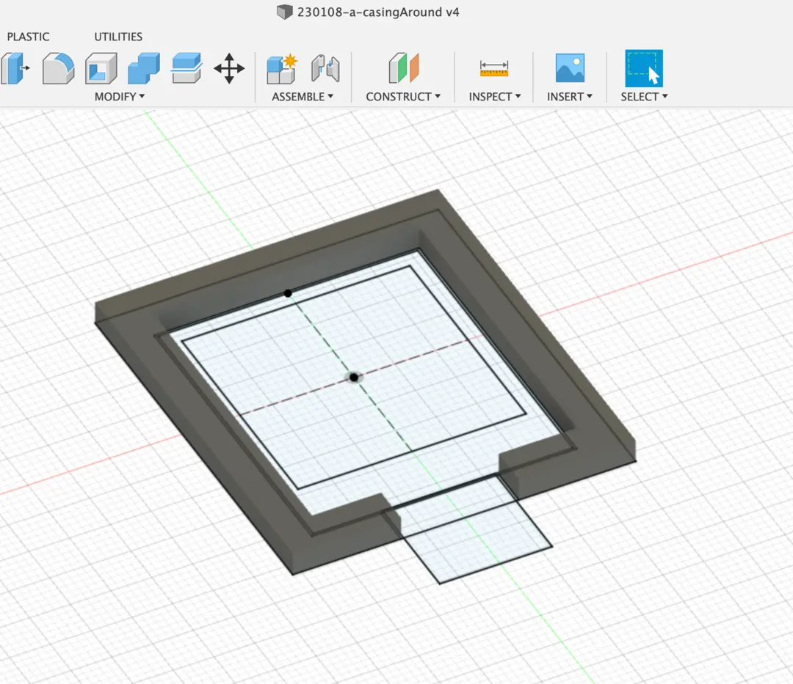
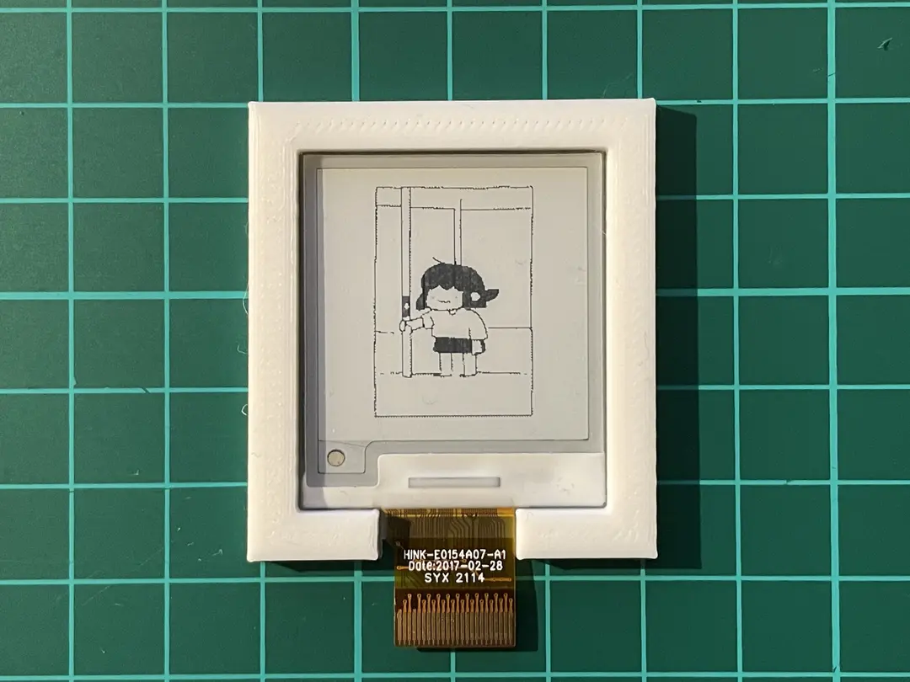

# Sizing

The printer I'm using has a min. slice thickness of `0.12mm`.
The precision is `+-0.1mm`.

The added space for the screen was `0.1mm (precision) * 2 + 0.12mm (wiggle)` for a total of 0.32mm which seems to have a snug fit.

