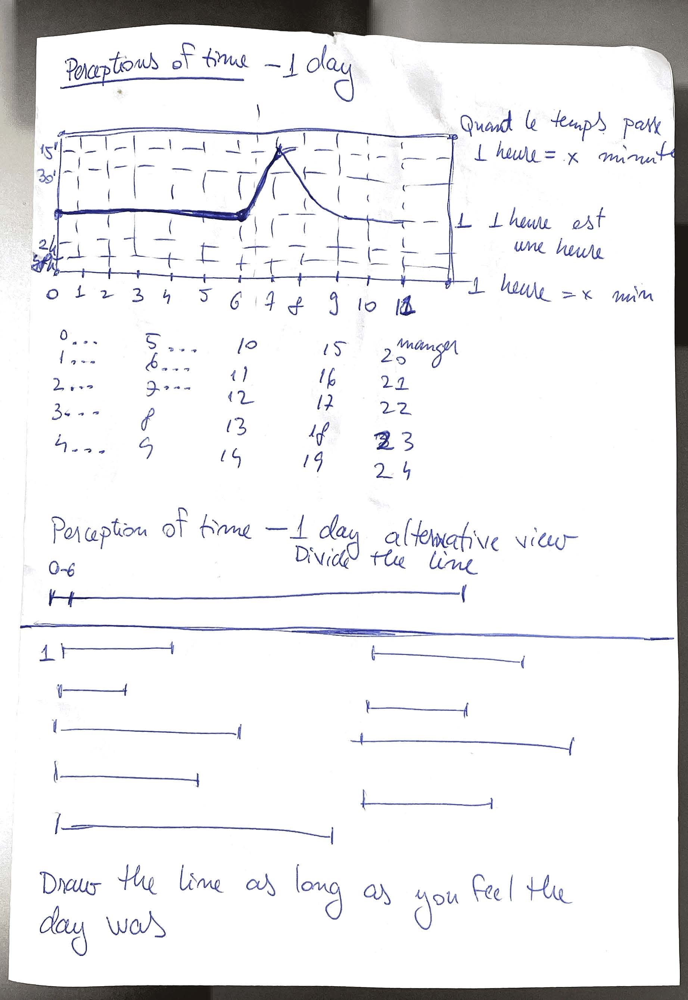
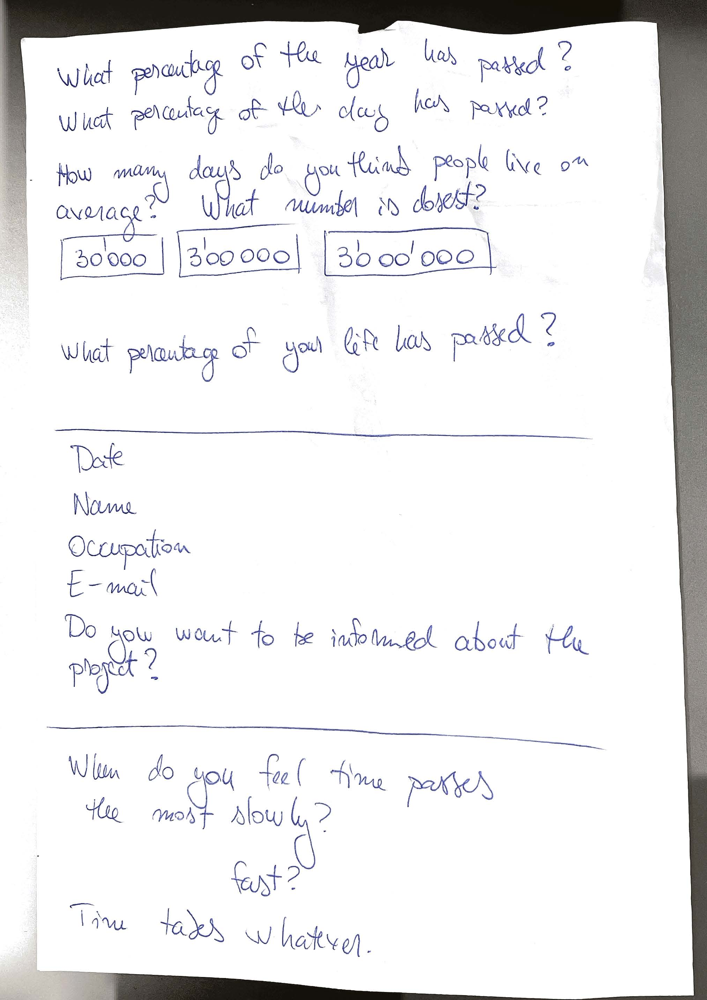
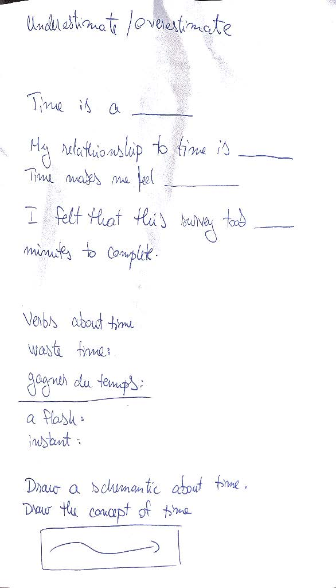
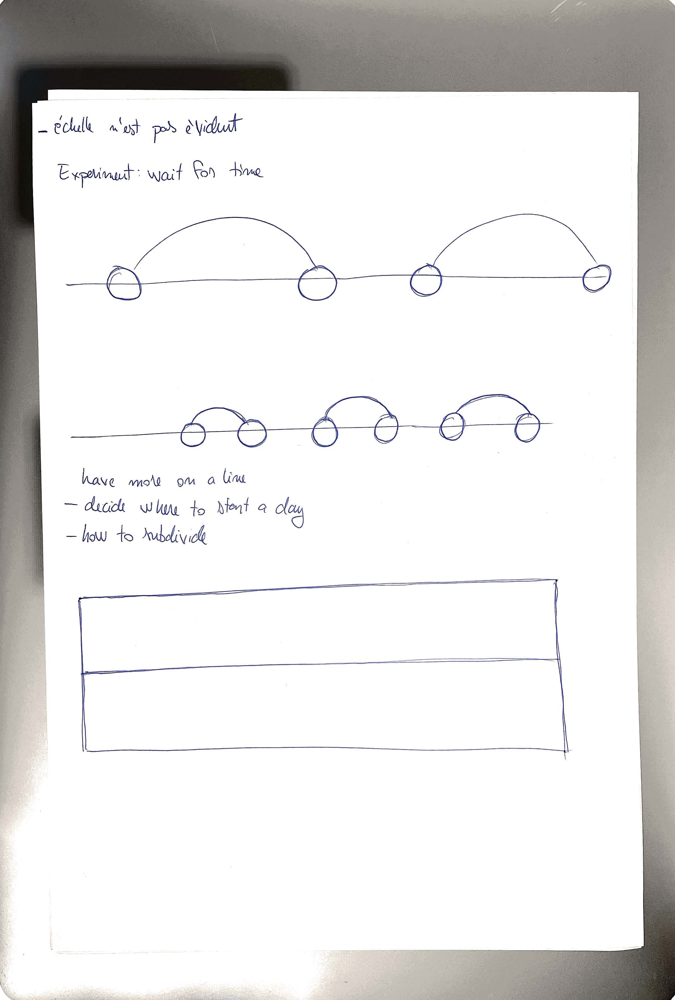

# The process

## Train trip 2022-10-26, Wednesday
I'm in a hurry to get the questionnaire together. I am looking to use LateX, because the version control.

## Questionnaire 2022-10-24, Monday
A questionnaire would be a good way to gauge insights about this. It's not obvious how to ask the question, without introducing bias about time. For instance according to the drawing below the current vernacular would be used.

I'm going to need to get basic information about people.

## Research 2022-10-23, Sunday
### Findings

> “Clocks, it is often forgotten, do not keep the time, but a time” (Nanni, 2012, p. 1)

> “The Shepherd gate clock [...] was the first clock ever to show Greenwich Mean Time directly to the public. It is a 'slave' clock, connected to the Shepherd master clock which was installed at the Royal Observatory in 1852.”(What Is Greenwich Mean Time (GMT) - and Why Does It Matter?, n.d.)

> By 1866, time signals were also sent from the clock to Harvard University in Cambridge, Massachusetts via the new transatlantic submarine cable

It was 24 hours, with hour 0 starting at noon. 

## Questions

* How did GMT become the standard? Could it be elsewhere?
* What is Universal Coordinated Time (UTC)? How is it different from GMT? And why is it's acronym incorrect? 
* How do other people measure time?

## Thoughts

There is not one correct time. Convention made it so.

Conventions are political. Time is also.

The time convention doesn't work for everyone, it can be illustrated by extreme cases. (Whyman, n.d.) 

### Bibliography

Alice Cappelle (Director). (2022, September 27). Time is a social construct. https://www.youtube.com/watch?v=MV0CaXPteMs

Nanni, G. (2012). The colonisation of time: Ritual, routine and resistance in the British Empire. Manchester University Press ; distributed in the United States exclusively by Palgrave Macmillan.

What is Greenwich Mean Time (GMT)—And why does it matter? (n.d.). Retrieved October 23, 2022, from https://www.rmg.co.uk/stories/topics/greenwich-mean-time-gmt

Coordinated Universal Time. (2022). In Wikipedia. https://en.wikipedia.org/w/index.php?title=Coordinated_Universal_Time&oldid=1115807783

French Republican calendar. (2022). In Wikipedia. https://en.wikipedia.org/w/index.php?title=French_Republican_calendar&oldid=1115858093

Network Time Protocol. (2022). In Wikipedia. https://en.wikipedia.org/w/index.php?title=Network_Time_Protocol&oldid=1116034659

Soviet calendar. (2022). In Wikipedia. https://en.wikipedia.org/w/index.php?title=Soviet_calendar&oldid=1116017950

Whyman, T. (n.d.). Can we abolish time? The Outline. Retrieved October 23, 2022, from https://theoutline.com/post/7647/can-we-abolish-time
